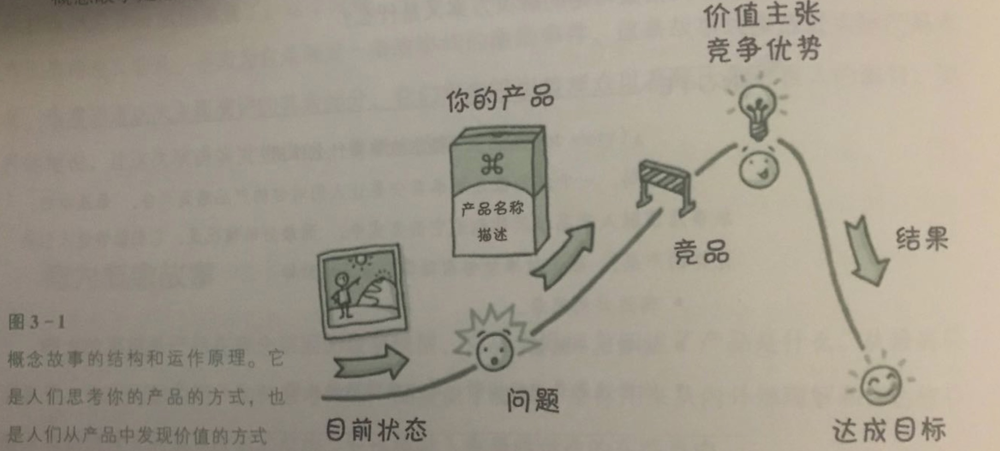

# 产品故事地图

[TOC]

我的第一篇读书笔记

人类是追求意义的生物，故事是我们最核心的意义生产工具；在漫长的进化历程中，我们依靠发展出的故事能力理解这个世界，传承文化、知识。故事是人类用来理解外部世界并与之交流的强大工具，故事驱动大脑的进化。

人类社会依靠一系列故事维系，人类的历史就是一个人故事。在原始部落有些人不事生产，他们既不狩猎也不采集，却拥有极高的地位，原因就是他们擅长讲故事。

优秀的产品必然是一个优秀的故事，使用故事介绍自己的产品事半功倍；因为没有人不爱听故事，所有人都从故事中寻求共鸣。

当我们体验一个基于故事的东西，大脑就会被激活，不论是观赏电影，坐过山车，还是浏览网页，使用APP；我们的大脑都会经历以下过程：

- 记住这次体验
- 从体验中感受价值
- 在体验中感受操作的便利
- 拥有更轻松的时光，不管我们要完成什么
- 想要再次体验

《产品故事地图》介绍了采用故事发掘需求，设计功能，引爆情感，产生共鸣的方法论。

## 故事地图化

一个故事都有三个阶段

每条故事线都包含以下元素

- **开场**，开场阶段的素材在所有故事中一样，包括概念故事、起源故事、使用故事
- **激励事件或问题**
- **上升**
- **危机**
- **高潮或问题解决**
- **回落或结局**
- **剧终**

每个故事必然包含这七个元素，如果在高潮时，没有经历回落而是戛然而止，这个故事被称做**惊险故事**，应当避免。

## 故事的作用

每个故事都在讲述一种**体验**，每种体验都是一种生活方式。从这个角度看创造产品的本质就是创造**英雄**，即使只是买一支牙膏这样的小事，也是一次超级英雄之旅。

下面是一个超级英雄故事的发展过程，不论是不同文化背景中流传的神话故事，还是现代的超级英雄故事都遵循着相同的故事发展脉络。

任何一个英雄都经历了三个阶段

1. 启程
2. 启蒙
3. 回归

这三个阶段又细分为12步，我们称为英雄的旅程

（上图截自[看遍科幻大片 第一季：超级英雄那么多 讲述的却是同一个故事](http://v.youku.com/v_show/id_XMzQwNzM2MDM2NA==.html?spm=a2hww.20027244.m_250046.5~5!2~5~5!5~5~5~A)）

即使不是英雄故事，甚至在我们的日常生活中也时刻经历着类似的过程。

- 下面是我买一支牙膏的过程
  1. 平凡的世界：我每天都要刷牙
  2. 历险的召唤：牙膏就要用完了
  3. 拒绝召唤：不想下楼去买，剩下的还能用一段时间
  4. 外来的帮助：这时候我想起来有淘宝网
  5. 启程：我打开淘宝
  6. 试炼之路：在淘宝页面搜索牙膏
  7. 接近最危险的洞穴：终于找到一家我能接受的价格
  8. 危险时刻：一番讨价还价
  9. 得到嘉奖：得到了比标价更低的价格还顺丰包邮
  10. 回去的路：关闭淘宝页，去做别的事了
  11. 胜利的结果：等待发货，每天刷一刷物流
  12. 满载而归：收到牙膏，这就是我想要的

你读这段话的时候会不会觉的无聊？这就是我们每天在做的事，这就是我们的故事——从早晨起床、洗漱、买早餐，到晚上洗漱、睡觉——每天做的所有事都可以用这个过程讲述。甚至使用淘宝的每一步都可以继续拆解成更小的故事，还可以用这12步讲述。

故事潜在结构的好处是它能提供一个概念框架，将我们的用户转变为**英雄**。这个概念框架包含情节点、高潮点。故事是我们拥有的创造英雄人物的最古老也最强大的工具之一。

如果用户喜爱我们的产品，就会推荐给其他人使用，自己也会继续使用，只要能继续让他们感到满意。他们甚至会原谅产品的一些错误或瑕疵，即使产品出现意想不到的状况或者没有按照他们喜欢的方式表现。**用户不关心产品或品牌，他们只关心自己。**这是我们创造产品时应该拥有的理念。

## 概念故事

概念故事定义：

- 概念故事就是产品在观念层面的故事模型
- 它定义产品及其价值观念
- 它从全局视角阐述了产品是什么。

从最高层面来说，它也为你的用户如何思考你的产品提供了框架，是你从内外部理解和传达核心概念和价值理念和结构，它也将融入你最终创造的东西当中。

用来定义产品的概念故事可以帮助你回答下面的问题：

- 产品的目标客户
  - 他们的问题是什么？
  - 他们的主要目标是什么？次要目标是什么？
- 产品是什么？
- 竞品有哪些？
- 为什么有些人可能**不会**想要使用这些产品？
- 这个产品比竞品强的地方在哪里？
- 这个产品需要做哪些事？
  - 它对问题最直接的解决方案是什么？
  - 这个问题**最令人拍案叫绝**的解决方案是什么？

一个好的概念故事至少让人们对产品感到兴奋。故事应该融入产品以及创造它的方式中。而最好的情况是，它们能够让人们谈论这个产品。概念故事能够帮助实现三个目标：

- 传达共同愿景
- 遵循这一愿景
- 依据该愿景进行创新，确立事情的优先级

概念故事地图：

- **开场**：事物的当前状态。
  - 用户是谁？
  - 用户要什么？
  - 用户想做什么？
- **激励事件或问题**：产品有待解决的问题
  - 用户存在的问题或需要，有一个主要目标
  - 为什么用户不能实现自己的目标？
  - 没有问题，就没有解决方案，也就没有故事
  - 不一定是严重问题，或关乎生死，甚至可以是很无聊的问题
  - 用户可能知道也可能不知道问题，需要向他们展示
  - 用户可能用其它方式解决问题，我们的产品很少是完全没人涉足的领域
- **上升**：产品名称和简介、市场类别
  - 当产品、服务能够解决用户面临的问题，故事就呈上升态势
  - 产品应有一个名称、一个简要的描述或一个市场类别
- **危机**：竞品
  - 竞争对手即危机
  - 可以是另一个产品、服务或功能
  - 可以是目前解决问题、满足需要的另一种可选方式
  - 可以是某种情绪，例如抵抗变化、不愿意接纳新事物
- **高潮或问题解决**：解决方案和价值主张、竞争优势
  - 当激励事件呈现的问题和危机时刻浮现的障碍都被解决或克服，高潮来了
  - 产品帮用户解决问题的方式成为产品的价值主张
  - 隐含在价值主张中的理念：产品不仅独特，而且比其它可选方案更能解决用户的问题
  - 要有冲突，要有高潮；否则就是一个平淡无奇的故事，没有吸引力
- **回落**：结果
  - 故事的主人公完成了某个行为，英雄完成了一项任务
  - 但是“然后呢”？这就是回落
  - 产品解决了一个问题，并以令人信服的方式占用了竞争对手
  - 概念故事的回落处理主人公的思考、感受，回味体验的过程
  - 没有回落的故事
    - 故事不完整
    - 产品不适合目前市场
      - 利用真实数据构建故事会使故事变的强有力
      - 如果回落只是假设，应在真实的用户中或用真实的数据测试之
- **剧终**：目标达成
  - 用户看到自己达成目标
  - 高层次的公司目标或使用应与故事产生共鸣
  - 即使公司目标与用户目标不一致，故事应该同时适用于二者
  - 确保所有指向这一时刻的情节点都能有机结合

## 起源故事

起源故事就是如何成为产品的用户的故事，它讲述人从如何知道产品并开始使用的故事。

起源故事渗透进产品营销以及实际产品设计的前前后后。

对客户来说，起源故事涵盖了如何思考产品，以及使用产品做什么的方方面面。

概念故事与起源故事的区别：

- 概念故事说明用户为什么需要这个产品，起源故事说明用户如何找到这个产品，又是因为什么以及通过什么方式开始使用。
- **概念故事更宏观，起源故事更注重具体的战术**

起源故事的作用：

- 帮助找到传递价值理念
- 推动人们采取行动
- 让用户第一次体验到价值理念的方法

起源故事非常依赖概念故事中发现并描述的故事元素，因此可以复用概念故事的一些情节点。

起源故事地图：

- **开场**：事物的当前状态（与概念故事一样）
  - 我们知道用户是谁（目标用户是谁？）
  - 我们知道用户想要什么（用户的主要目标，用户需要做什么？我们会为用户带来什么变化？）
  - 用户使用我们产品的目的是什么？
- **激励事件或问题**：问题或激发情绪的事件（与概念故事一样）
  - 用户的问题或需求（用户的痛点是什么）
    - 用户自己知道
    - 用户不知道，需要我们告诉TA
    - 通常用户可能会通过其它途径解决问题
- **上升**：获取渠道
  - 获取途径或品牌认识渠道
    - 如何了解我们的产品？
    - 用户通过哪些渠道找到我们的产品？
    - 我们要利用用户找到我们的渠道传达什么价值？
    - 我们要呈现什么功能？
    - 有哪些痛点促使用户发现我们的产品？
  - 从概念层面转变成实际事件
  - 用户可能会从多种途径发现产品
- **危机**：用户体验到的抵抗与阻碍
  - 如果完成了概念故事，可能已经发现了潜在的危机；这些危机就要考虑进起源故事
    - 用户会遇到什么阻碍？
  - 冲突、紧张在本阶段浮现，让体验故事的人感到故事更有趣和满意
  - 没有紧张气氛，不能让人兴奋，就不是好故事
  - 危机出现在
    - 潜在用户思考为什么不采取行动时
    - 用户对我们的产品或宣传内容感到困惑时
  - 可能的危机
    - 竞品
    - 其它解决方案，自行解决或类似方案
    - 不愿意尝试新鲜事物或采取新行动的一般倾向
    - 对安全和隐私的担忧
- **高潮或问题解决**：为什么用户在乎
  - 高潮发生在用户**理解/看到**了产品价值
  - 此时用户还没有解决自己的问题，或实现自己的目标
  - 但是用户能够预见到问题会解决或目标会实现
  - 这是用户旅程的实际步骤，需要仔细考虑高潮何时发生
  - 用户在第一次知道我们的产品，或正在慢慢探索时
    - 我们希望用户接触到什么？
    - 希望用户接下来去哪里
    - 要给用户展示什么，使用户产生共鸣？
- **回落或结局**：用户采取了行动
  - 用户已经了解了产品能做什么
  - 希望用户接下来做什么（希望用户采取什么行动？）
  - 理想情况下会采取的动作，是一个快乐路径
  - 规划各种可能和分支路径
  - 此时不管用户想干什么
    - 一定要让用户采取行动
    - 也要让用户体验到价值
  - 这个情节要如何结束既满足用户又满足业务需要
  - 常见的起源故事回落，每一个都值得用另一个讲述
    - 试用
    - 注册
    - 了解更多
    - 打电话
- **剧终**：暂时达成目标
  - 用户实现了自己的目标
    - 目标是什么？
    - 用户如何知道自己是否达成目标？
  - 达成核心业务目标
    - 高层次的公司目标或使用是什么？
    - 它应该可以测量
  - 关键是：
    - 让主要角色行动起来
    - 确定如何测量这些行动，包括用户达成目标时的行动，以及走向结尾的每一步行动
  - 第一次接触的故事应该如何结束？

下图是Pinterrest起源故事

## 使用故事

**峰终定律**：人类记住的不是体验的持续时间有多长，而是体验的高峰点和临近结尾时发生的事。

使用故事定义：

- 用户实际使用产品的故事
- 包含用户的操作步骤、使用过程
- 使用故事可以持续几秒到几年
- 它定义用户如何使用产品
- 如何让用户在使用中体验到产品价值以及为什么会体验到
- 如何让用户继续使用产品以及为什么会继续使用

使用故事地图：

- **开场**，事物的当前状态
  - 我们的目标用户是谁？
  - 用户使用产品的主要目标是什么？
  - 阻碍用户实现目标的问题或障碍是什么？
- **激励事件或问题**，事件、诱因或唤起行动
  - 与概念故事描述的问题相对应
  - 提醒自己用户的问题是什么？
  - 用户为什么无法达成目标？
  - 什么能够让用户踏上这趟独特的旅程？
- **上升**，一系列步骤
  - 用户为达成目标采取一系列步骤
    - 每一步都应强化用户兴趣
    - 每一步都比上一步更有趣、更重要
  - 对用户来说事情正在变的越来越好
  - 用户应该采取的第一个行动是什么？
  - 接下来呢？
  - 然后呢？
- **危机**，潜在的障碍
  - 用户为达到体验高潮需要克服的障碍
  - 什么阻碍用户解决问题、达成目标？
    - 有形障碍
    - 情绪或感情障碍
- **高潮或问题解决**，体验到产品价值时的高潮点
  - 问题解决了，危机克服了
  - 使用故事最关心的不是问题是否解决，而是**如何解决**
  - 如何解决是用户体验到价值或对自己感到满意的地方
  - 如果仅仅解决问题就能让人满意，故事可以进行的顺畅，但是缺乏高潮
  - 有时需要额外的鼓舞提升这一情节点的行动水平，以便给人留下深刻印象
  - 这一体验或流程的高潮点是什么？
  - 用户的问题怎样解决的？
  - 希望用户在使用中体验到怎样的价值？
  - 什么可以让用户目前遭遇的冲突、危机和负担变得有意义 ？
    - 价值可以是功能性或抽象的
- **回落**，然后呢？流程的最后步骤
  - 用户完成了整个流程
    - 但是故事不能在高潮点结束
    - 而要把用户带到某个地方
  - 每次在这个情节点都要问自己：**然后呢？**
    - 确保自己找到结束的方法
  - 然后呢？
    - 人类喜欢闭合
    - 所以不要在高潮点戛然而止
    - 既然解决了问题，就应该给故事画一个圆满的句号，让用户更加接近目标
- **剧终**，暂时结束
  - 目标达成
  - 故事的主人公，我们的英雄又回到了原点
    - 准备下一段旅程
    - 但是用户的处境应该比一开始更好
      - 主人公明白了某个道理
      - 主人公发现了某个东西
      - 主人公一般性的获得成长
      - 主人公回到家时，已经不是原来的自己，而且跟自己的主要目标更加接近
  - 就人物发展和情节逻辑来说，用户的故事要如何结束？
    - 怎样获得了成长？
    - 学到了什么？
    - 身处何方？
    - 接下来如何？
    - 故事真的结束了？还是下一个故事的起点？

故事可大可小，可能发生在某个时点，可能是连续的事件，可能持续几秒的微型故事或数年的史诗故事。

我们的问题可能是：

- 如何让用户在几年后仍然保持活跃、避免流失？
  - 可以策划一个持续数年的史诗故事
- 如何让用户不断的使用
  - 可以策划一系列连续的故事
- 面对竞品，如何让用户不断使用我们产品的核心功能？
  - 可能需要一个微型故事
  - 于细节处见成败

不论是上述问题的哪一类，故事的情节点和整体结构都是一样的，惟一的不同是时间线的差别。

使用故事的分类：

- 史诗故事：历时较长、超过单次互动的故事
- 连续故事：一个故事的结尾是下一个故事的开场
- 微型故事：核心任务
  - 再小的流程或任务都可以视为一段叙事
  - 希望用户频繁交互的任务
  - 表现核心任务的使用故事要让用户印象深刻

## 心理模型

即使分钟级的体验也要符合用户对叙事结构的心理模型。否则可能造成用户流失。

如果用户第一次使用就能吸引他们，让他们体会到产品和服务的价值，就更容易让他们回来。

一个故事结束是下一个故事的开端和悬念，一个个故事连起来，构成故事集，也称系列故事。系列故事随着时间推移而持续，并变得更好

**有人想要做某事，有东西阻碍了他们，有东西可以帮助他们克服这一阻碍，他们得到了想要的，剧终**

## 找到故事

**想法来自万事万物——阿尔弗雷德希区柯克**

- 倾听
- 微笑测试
  - 在故事线的高潮点画一个笑脸，测试故事原型，确保高潮点确实是能够让用户微笑的时刻
- 测量
  - 搜集用户数据
  - 如果在故事线中有用户急剧下降的现象，一定是某些故事点不合理
- 多多提问：如果……会怎样
- 借鉴：作为概念性验证的故事
  - 从影视作品、科幻作品中寻找灵感

## 应用故事战略工具

- 图表
  - 围绕“快乐路径”或理想化故事线，即期待用户体验到的东西创建故事流程
  - 可以考虑分支路径、边缘路径等
  - 故事可以有多条分支，时间和体验则是线性的。
  - 要根据期待故事的发展安排计划，做相应的变通
  - 简单引导用户，不要把事情变的复杂
- 故事板
  - 故事板要简短，帮助聚焦故事，不要范围太大细节太多，否则容易丢失故事线
  - 确保激励事件尽可能快的发生，高潮或解决方案后要立刻进入结尾
  - 迅速开头和结尾，不要拖得太长
- 战略性故事地图
  - 故事地图作为框架
  - 根据地图创造产品和服务，决定哪些是需要的用来支持故事的东西
  - 首先绘制故事地图，不断充实完善
- 差距分析
  - 如果要改善当前状况，可以绘制故事将当前状态和期望的未来状态差距视觉化
- 行为分析
  - 如果要知道不同类型的用户故事，可以用不同颜色代表各类用户
  - SWOT分析（优势、劣势、机会、威胁）
    - 故事线是探索和视觉化用户旅程，SWOT分析的轻量级方法
    - 发现故事的可能形态，可行、不可行的、遗漏的、可以成为什么
    - 绘制故事线时时刻注意考虑SWOT这四方面
- 撰写故事
  - 言简意赅
  - 行文留白，不必事无巨细，文字没有提到的读者会自动补充完整
  - 少即是多，多指引人入胜
  - 某个事物只要是能够支撑起某个故事，就算再微小、快速或不重要也能融入设计和原型中。如果故事足够强大、吸引人，就不仅能把demo留到最后，也能用叙述来强调这个故事

**没有故事会让客户和潜在投资者迷惑不解。有了故事，他们会感到振奋。这是为了人类更好的参与和理解周围世界进化出来的优良而古老的故事能力。它适用于产品的想法、实际的产品以及将产品呈现给世界的方式。它不仅帮助卖出产品，也能帮助打磨出表现更好的产品。更重要的是，故事优先的方法能够让用户获得更好的产品使用体验。==用故事进行设计是人的天性==。**

故事不仅是用来交流的。它必须与受众产生共鸣。每个环节都必须不断测试你的故事，确保自己的方向正确。一旦开始在自己的工作中更多的使用故事，当某个东西是或不是一个有效的故事时，就会发现自己是否在正确的轨道上。只要将自己的想法呈现在别人面前就会立即得到反馈，就会知道故事会不会与别人产生共鸣，从而验证你直觉上认为的高潮点。如果一切顺利，会有人在无意间为产品背书。

如果一个故事结构合理，它就会融入一切。保证围绕故事进行创造的不仅仅取决于你，也取决于故事是否能够引起外界的共鸣和回响。

## 经验法则

- **故事由角色驱动**
  - 故事的主人公必须是体验故事的人，必须是真实的人，真实的目标，真实的故事。
  - 人体验的一切必须能够推进故事，如果不能就必须删掉
  - 如果接触不到真实的人和真实的数据，可以编造，然后必须验证
  - 角色是目标驱动的
  - 我们的职责是确保故事不断推进向前发展、帮助主人公达成目标。
  - 漫无目的的故事是最糟糕的
- **目标可以改变**
  - 不变的人性，善变的人心。
  - 故事一开始，主人公想要的和真正需要的不一定是一致的，也不一定是显而易见的
  - 尽管目标可以改变，但是主人公不一定知道自己的目标是什么，帮助他们找到目标也是我们的职责之一
- **目标可以测量**
  - 创造出的故事应当可以测量，不管是对用户还是公司。
- **冲突是核心**
  - 缺乏冲突就不能称为故事，只是一系列事件，只有事情在发生。
  - 冲突使故事变的紧张，引人入胜，最终以令人满意的结果收场，在事件中要时常设置一些冲突点
  - 为冲突设计故事，可以帮助我们判断接下来要发生的事
  - 围绕故事设计产品，考虑可能的障碍，提前计划，帮助主人公克服障碍、稳步前进并最终达到目标
- **数学是有趣的**
  - A*B=C
  - 在物理世界有相当多的定律都是用这个简单的数学公式描述
  - A是动力，是用户利用产品达到目标的力量
  - B是阻碍用户的力量
  - C是两种力量共同作用的结果，促使用户使用产品解决冲突，故事达到高潮
- **选择自己的冒险**
  - 系统是复杂的，涉及各种决策点、分支、交互、反馈循环、支线剧情、依赖关系、无限组合
  - 但是人类体验是线性的，要吸引用户就要为用户的体验而不是为系统设计，因为体验发生在时间序列中
  - 当利用故事达到、设想或计划预期的体验时，要用线性拥抱复杂性，一次一个故事
  - 每个角色、每个场景、每个用例、成功路径、边缘案例，每个都是独立的故事
  - 不同的故事可能有重叠，可能有共同特征的和情结点，发现这些重叠和共同特征是有价值的；但是每个故事要自成一体，形成闭环
- **让产品引爆**
  - 在原始部落中有一些人他们不事生产，不狩猎也不采集，不劳作，但是他们在部落中德高望重，拥有很高的地位，因为他们擅长讲故事
  - 人类的文化在故事中传承，依靠故事交流
  - 人类依靠故事，体验、注意、学习、发现价值
  - 最终的引爆可能是故事中微不足道的细节，但是至关重要。可能是地图上标记用的图钉，可能是小动画。最终让用户的头脑中产生“嘭”的感觉

## 参考书目

《产品故事地图》

《神话的力量》

《千面英雄》

[看遍科幻大片 第一季：超级英雄那么多 讲述的却是同一个故事](http://v.youku.com/v_show/id_XMzQwNzM2MDM2NA==.html?spm=a2hww.20027244.m_250046.5~5!2~5~5!5~5~5~A)

---

申请微信公众号有很长时间了，一直没有想清楚究竟应该发一些什么。后来想应该分享一些自己的原创思想和IT从业感悟，花了很长时间我才接受一个事实：我没有能力分享什么原创思想。T_T

最近我想到平时没事会读各种书，不如就把读书笔记分享到公众号。

> 本人在此做以下承诺
>
> - 我不创造知识，我只是知识的搬运工。
> - 所有文章只在本订阅号发布，同时会同步到github（https://github.com/runfriends/notes.git）
> - 所有内容都是本人平时读书记录的笔记和自己的心得感想
> - 绝不转发、抄袭他人文章，如果我的文章侵犯了您的权益请告知，本人会立即删除，并公开道歉

帖上订阅号二维码：

