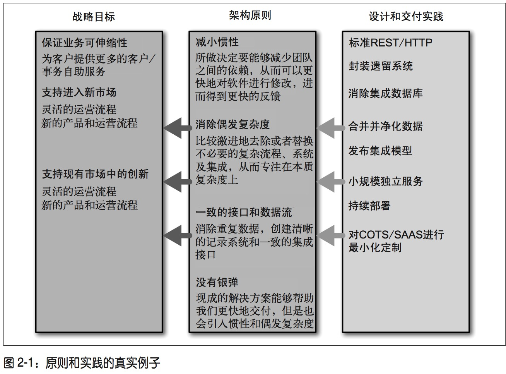

# 微服务设计

[TOC]

我的第二篇读书笔记

## 什么是微服务

一些协同工作小而自治的服务。

- 很小，专注于做一件事
  - 内聚性
    - 把因相同原因而变化的东西聚合在一起
    - 把因不同原因原因而变化的东西分离开
  - 根据业务边界确定服务边界
  - 服务越小，独立性越强，管理越复杂
- 自治性
  - 微服务是独立的实体
  - 通过网络通信实现交互，加强隔离性，避免紧耦合
  - 服务可独立修改、独立部署，而不引起消费方的变动
  - 服务间仅通过暴露出的API交互，API的实现不应与消费方耦合
- 技术异构性
  - 由于服务间通过一致的网络通讯协议实现交互，不同的服务可以按照自身特性采用最合适的技术实现
- 弹性
- 扩展
  - 可以针对某个服务进行扩展
- 简化部署
  - 单体应用
    - 即使只改一行代码也可能影响整个应用
    - 部署风险高
    - 干系人不敢轻易部署，因为实际部署频率低
    - 每次发布都有很多大变更
  - 两次发布差异越大，出错的可能性越大
  - 微服务架构
    - 各服务独立部署
    - 部署频率更高
    - 容易回滚
  - 与组织结构匹配
    - 小型代码库上工作的小团队更高效
  - 可组合性
    - 针对不同的终端和应用类型组合微服务
  - 可替代性优化
    - 小规模服务更容易替代，重构、更换技术栈更容易
- 没有银弹
  - 微服务不是通用准则

## 演化式架构师

- 架构师的重要职责
  - 确保团队有共同的技术愿景
  - 设计要足够灵活
  - 适应性
  - 根据用户需求演化
- 多样性
  - 大量需求变更
  - 技术多样性
  - 软件在运营过程中持续演化
  - ==放弃一开始就设计并实现一个完美产品的想法==
  - 设计合理框架
    - 在这个框架下演化出正确的系统
    - 能够很容易的将新知识应用到系统
- 架构师更像城市规划师，而不是建筑师
  - 优化城镇布局（优化模块划分）
  - 易于现在的居民生活（良好的用户体验）
  - 为未来考虑（应对将来的变化）
  - 更多考虑人和公共设施如何从在区域这间移动，而不是具体在每个区域中发生的事
- ==尝试直接对各方面进行控制不会奏效==
- 需要知道什么时候计划没有得到执行
- 尽量少的干预，专注于大方向
- 保证在这个系统上工作的人跟使用这个系统的人一样开心

### 分区

- 确认服务边界

### 原则性方法

- 取舍&标准
  - 取舍
    - 需要注意，系统允许多少可变性
    - 识别各个服务需要遵守的通用规则
  - 标准
    - 系统由很多小的，有自治生命周期的组件构成
    - 组件之间有紧密关联
    - 优化单个服务自治性的同时兼顾全局
    - 服务内部技术对外是黑箱
- 战略目标
  - 组织的前进方向
  - 需要确保技术层面的选择与之一致
- 原则&实践
  - 原则指导系统演化
  - 细节指导实现这些原则
  - 实践反映组织内的一些限制，同时巩固原则
  - 实践可以频繁变化，但是原则保持不变

- 实践标准

  - 监控
    - 系统级
    - 标准化
    - 不要为服务的具体实现改变监控系统
  - 接口
    - 选择尽量少的接口技术和协议，否则是服务消费者的噩梦
  - 架构安全性
    - 保证每个服务可以应对下游服务的错误请求
    - 处理不好下游错误请求的服务越多，系统越脆弱
    - 返回码遵守统一规则，对以下几种请求做不同处理可以帮助系统及时失败，容易追溯问题，如果系统没有遵守这些规则，就会更脆弱
      1. 正常且正确处理的请求
      2. 错误请求，服务识别出它是错误的，但是什么也没做
      3. 被访问的服务宕机，无法判断请求是否正常

- 代码治理

  - 就如何做事达成共识很容易
  - 花时间保证人按照共识做事很困难
  - 应该采用简单方式把事情做对
    - **==提供范例和服务代码模板==**
      1. 为希望别人采纳的建议提供代码范例。如果有良好范例可以模仿就不会错的离谱
      2. **==范例应该来自真实项目==**
         - 而不是专门实现的完美例子
         - 真实的功能确保范例体现的原则是合理的
    - 裁剪服务代码模板
      - 实现新服务的核心属性代码都应该是现成的
      - 针对自己的开发实践裁剪服务代码模板
        - 提高开发效率
        - 保证服务质量
        - 不同的技术栈都提供一个服务代码模板
      - 代码模板
        1. 不是中心化工具的职责
        2. 不是指导应怎样工作的架构团队的职责
        3. 应通过合作方式定义这些实践
        4. 整个团队负责更新这这个模板
        5. 可以选择使用，而不是强制
        6. 确保能够简化开发工作，而不是复杂化

- 技术债

  - 有可能不能完全遵守技术愿景
    - 为了发布紧急特性，而忽略一些约束
    - 偏离愿景可以带来短期收益，但是要为长期后果付出代价
    - 现实世界有债不还要去坐牢，技术债不还会让人疲于应付甚至崩溃
    - 可能引入技术债的途径
      - 走捷径
      - 系统目标与现在实现不符
    - 架构师应做出权衡
      - 指导团队，让团队自行决定如何偿还
      - **维护债务列表，定期回顾**

- 例外管理

  - 微服务团队应高度自治，没有原则例外
  - 多次发生的原则例外应成为新的原则，固化为团队的认知

- 集中治理和领导

  治理通过评估干系人的需求、当前情况及下一步的可能性来确保企业目标达成，通过排优先级和做决策来设定方向。对于已经达成一致的目标进行监督

  - 架构师确保有一个技术愿景，治理就是要确保我们构建的系统符合这个愿景
  - 可以有一个由架构师领导的治理小组
    - 有一线参与，每个团队都有人参加
    - 讨论并制定原则
    - 负责跟踪和管理技术风险
    - 架构师对小组施加影响，确保大方向，但是不要过多干涉
      - 即使清楚什么是对的，也不要试图控制团队
      - 要让团队感到自己有话语权

- 建设团队

  - 执行技术愿景不等同于做技术决定
  - 更重要的是帮助团队成员成长，帮助他们理解愿景，让他们积极参与到愿景的实现
  - 微服务架构的代码库自治，有自己的生命周期。服务的负责人有更多负责机会，帮助他们逐步达成职业目标
  - 不要僵化的固守自己的想法
  - 伟大的软件来自伟大的人，如果只担心技术问题，看到的问题远不及一半

---

申请微信公众号有很长时间了，一直没有想清楚究竟应该发一些什么。后来想应该分享一些自己的原创思想和IT从业感悟，花了很长时间我才接受一个事实：我没有能力分享什么原创思想。T_T

最近我想到平时没事会读各种书，不如就把读书笔记分享到公众号。

> 本人在此做以下承诺
>
> - 我不创造知识，我只是知识的搬运工。
> - 所有文章只在本订阅号发布，同时会同步到github（https://github.com/runfriends/notes.git）
> - 所有内容都是本人平时读书记录的笔记和自己的心得感想
> - 绝不转发、抄袭他人文章，如果我的文章侵犯了您的权益请告知，本人会立即删除，并公开道歉

帖上订阅号二维码：

