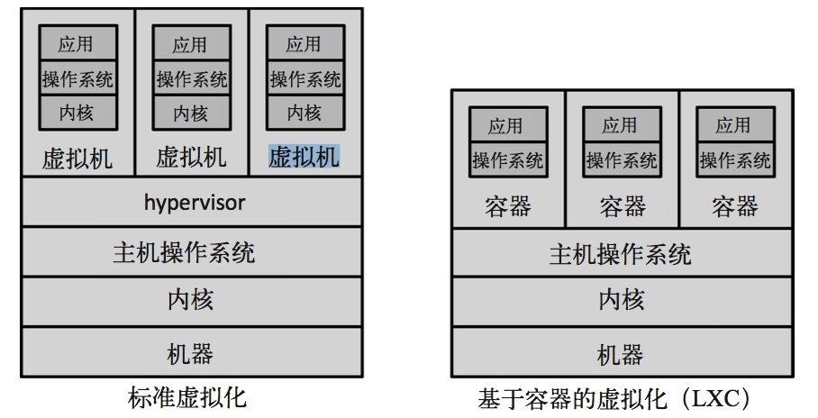

# 微服务设计

[TOC]

我的第六篇读书笔记

## 第6章 部署

### 持续集成（CI）

- 是否每到合并/提交代码
- 是否有测试验证修改
- 构建失败，团队是否把修复CI作为第一优先级

### 持续集成到微服务

- 首先是单体应用运行在一台主机上

- 当把单体应用拆分成微服务

  - 一台主机运行多个微服务
    - 代码库少
    - 面临的问题：
      1. 一次部署多个服务，即使有些服务不需要构建
      2. 构建周期长
      3. 不知道哪些服务应该重新部署
      4. 不知道是否需要部署所有服务保证修改生效
      5. 只能作为采用微服务的过渡阶段
  - 所有服务在一个代码库中，但是每个服务有独立的构建
    - 简化检出/检入
    - 让人觉的同时提交多个服务的修改奶容易，容易做出耦合更高的修改
  - 一台主机运行只一个微服务，一个服务一个代码库，一个服务一个构建
    - 什么时候不这么做
      - 尚未正确识别出稳定的服务边界
      - 经常发生跨服务边界的修改
      - 服务经常在模块间迁移

- 流水线构建&持续交付

  - 构建分解成多个阶段
  - 快速测试和耗时测试在不同的阶段

- 平台特定的构建

  - 如果是自己运营的服务，所有服务应当只运行在一个统一的平台上
    - 减少兼容问题，降低构建成本
    - 可以考虑采用操作系统构建物
      - CentOS的 RPM
      - Ubuntu的beb等

- 定制镜像并把镜像作为构建物

- 不可变服务器

  - 禁止对运行的服务器做拖动修改
  - 不论修改多么的小都要经过构建流程

- 服务配置

  - 所有配置的修改工作量应该很小，仅于环境的差异
  - 配置参数保存在配置管理中心，配置与构建物隔离

- 服务与主机的映射

  - 单主机多服务

    - 监控复杂，当监控某些资源的使用率时是监控某个服务还是整个机器
    - 服务负载过高，服务之间会抢占资源，服务间产生影响
    - 部署一个服务，可能影响其它服务
    - 不利于团队自治
      - 不同团队维护的服务部署在相同的主机上
    - 增加服务扩展复杂性
      - 即使每个服务的要求不同，也不得不对它们一视同仁

  - 应用程序容器

    - 类似Servlet容器，在一个容器上部署多个应用，仍然会产生服务间互相影响的问题

  - 每个主机一个服务

    - 简化监控和错误恢复
    - 减少单点故障
    - 可以为不同服务采用不同的部署技术

  - PaaS

  - 自动化部署

  - 虚拟化

    - 传统的虚拟化技术与基于容器的虚拟化，下图是两种虚拟化技术对资源消耗的对比

      

      ​

------

申请微信公众号有很长时间了，一直没有想清楚究竟应该发一些什么。后来想应该分享一些自己的原创思想和IT从业感悟，花了很长时间我才接受一个事实：我没有能力分享什么原创思想。T_T

最近我想到平时没事会读各种书，不如就把读书笔记分享到公众号。

> 本人在此做以下承诺
>
> - 我不创造知识，我只是知识的搬运工。
> - 所有文章只在本订阅号发布，同时会同步到github（https://github.com/runfriends/notes.git）
> - 所有内容都是本人平时读书记录的笔记和自己的心得感想
> - 绝不转发、抄袭他人文章，如果我的文章侵犯了您的权益请告知，本人会立即删除，并公开道歉

帖上订阅号二维码：

